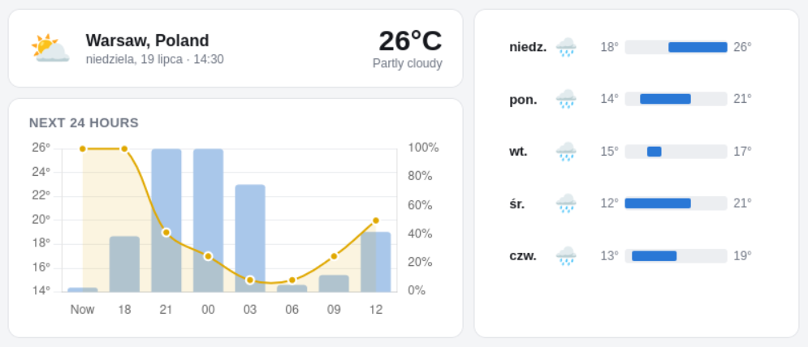

# Simple Weather Dashboard

A single-file, static weather dashboard. Shows current conditions, a 24-hour
temperature and rain-chance chart, and a 5-day forecast with scaled
temperature range bars. No build step, no backend, no API key — just one
HTML file you can open locally or host on GitHub Pages.

https://pktiuk.github.io/SimpleWeatherDashboard/



## Setting the location
 
The dashboard defaults to Warsaw, Poland, but you can point it at any place
via URL parameters — no code edit needed:
 
| Param  | Example                                            | Behavior                                         |
|--------|-----------------------------------------------------|---------------------------------------------------|
| `city` | `weather-dashboard.html?city=Tokyo`                  | Looks up the name via Open-Meteo's geocoding API and uses the first match. |
| `lat` + `lon` | `weather-dashboard.html?lat=48.8566&lon=2.3522` | Uses the coordinates directly.                     |
| `name` | `...&lat=48.8566&lon=2.3522&name=Paris,%20France`   | Optional label shown in the header alongside `lat`/`lon`. Ignored if `city` is used (the geocoding result's own name is used instead). |
| `theme` | `regular` or `monochromatic` | |
| `lang` | `lang=pl` or `lang=en-US` | |
 
If none of these are present, it falls back to the defaults defined near the
top of the `<script>` block:
 
```js
const DEFAULT_LAT = 52.2297;
const DEFAULT_LON = 21.0122;
const DEFAULT_LOCATION_NAME = 'Warsaw, Poland';
```

## Data source
 
Weather data comes from the
[Open-Meteo Forecast API](https://open-meteo.com/en/docs) — free for
non-commercial use, no API key, and CORS-enabled, which is what makes it
work directly from a static page.
